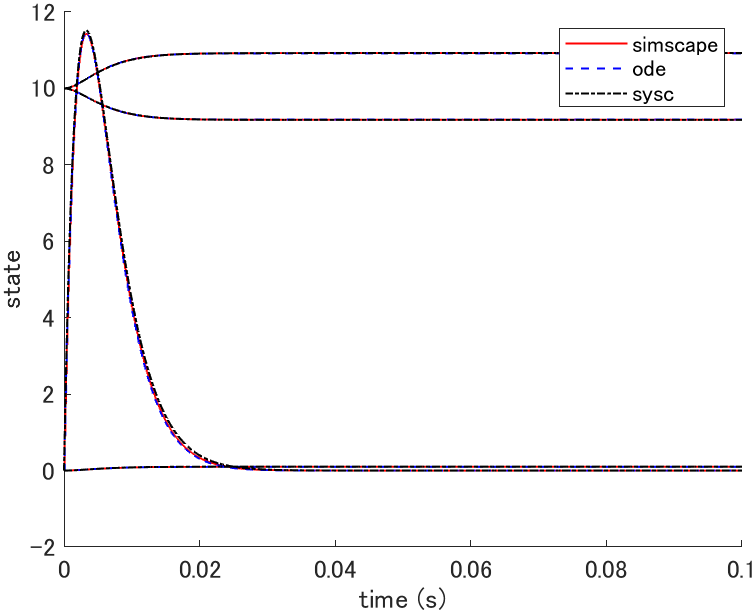
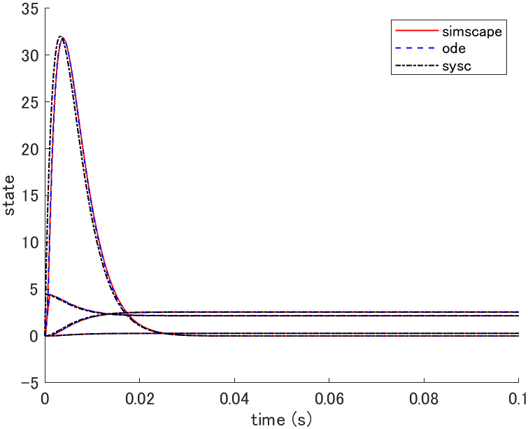
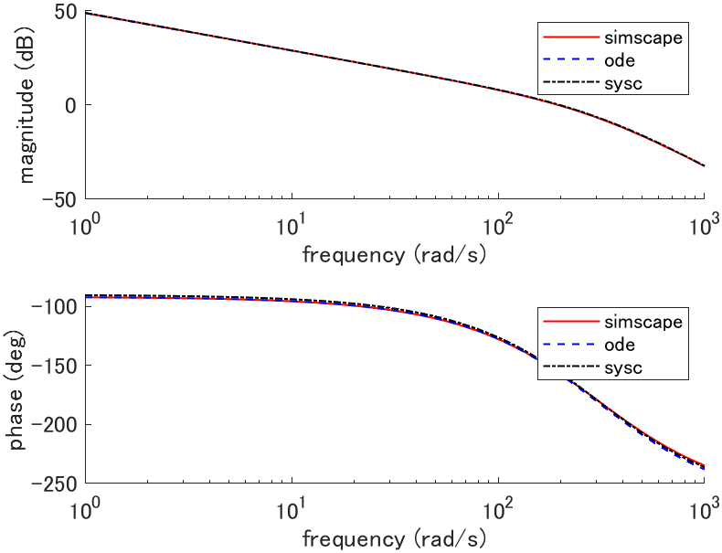
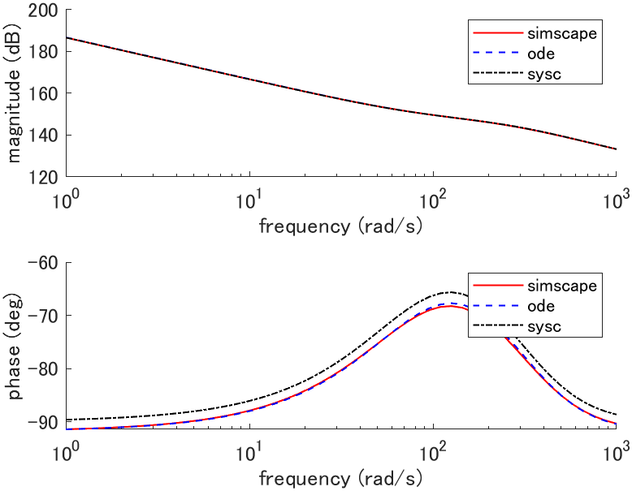
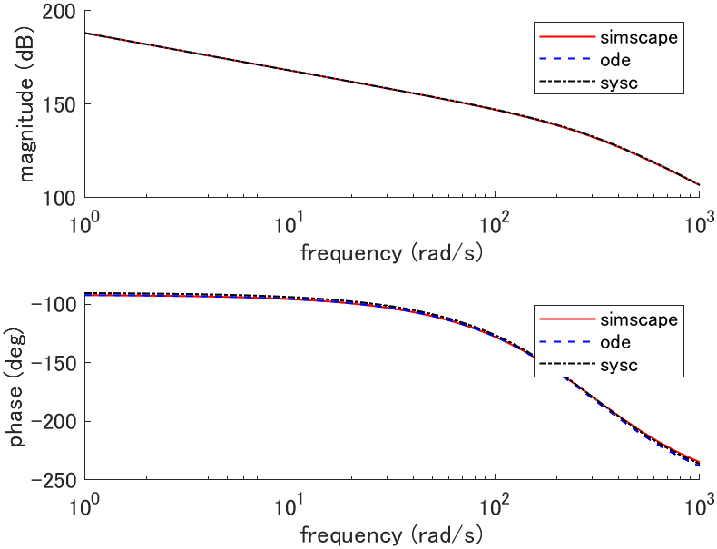

# Pneumatic cylinder

## System equations

Derived from the equation of state of an ideal gas under the following assumptions:

- Ideal gas
- Quasi-static process
- Chamber pressure and temperature are uniform (lumped parameter system)
- Kinetic and potential energy of a gas can be neglected

### Piston

```math
(M + M_e) \ddot{q}(t) + D \dot{q}(t) + F_e = A_c P_c(t) - A_h P_h(t) - A_r P_a
```

### Chamber

#### Case $`P_{\{ c,h \}}(t) \lt P_a`$

```math
\dot{P}_{\{ c,h \}}(t) = \frac{1}{V_{\{ c,h \}}(t)} \left\{ R T_a \left[ \alpha_{in} \dot{m}_{\{ c,h \} in}(t) - \alpha_{in} \dot{m}_{\{ c,h \} out}(t) \right] - \alpha \dot{V}_{\{ c,h \}}(t) P_{\{ c,h \}}(t) \right\}
```

```math
\mathrm{s.t.~~~} \begin{cases}
0 \leq \dot{m}_{\{ c,h \} in}(t) \leq \psi(P_s, P_{\{ c,h \}}(t)) \\
\psi(P_{\{ c,h \}}(t), P_a) \leq \dot{m}_{\{ c,h \} out}(t) \leq 0
\end{cases}
```

#### Case $`P_a \leq P_{\{ c,h \}}(t) \lt P_s`$

```math
\dot{P}_{\{ c,h \}}(t) = \frac{1}{V_{\{ c,h \}}(t)} \left\{ R T_a \left[ \alpha_{in} \dot{m}_{\{ c,h \} in}(t) - \alpha_{out} \dot{m}_{\{ c,h \} out}(t) \right] - \alpha \dot{V}_{\{ c,h \}}(t) P_{\{ c,h \}}(t) \right\}
```

```math
\mathrm{s.t.~~~} \begin{cases}
0 \leq \dot{m}_{\{ c,h \} in}(t) \leq \psi(P_s, P_{\{ c,h \}}(t)) \\
0 \leq \dot{m}_{\{ c,h \} out}(t) \leq \psi(P_{\{ c,h \}}(t), P_a)
\end{cases}
```

#### Case $`P_s \leq P_{\{ c,h \}}(t)`$

```math
\dot{P}_{\{ c,h \}}(t) = \frac{1}{V_{\{ c,h \}}(t)} \left\{ R T_a \left[ \alpha_{out} \dot{m}_{\{ c,h \} in}(t) - \alpha_{out} \dot{m}_{\{ c,h \} out}(t) \right] - \alpha \dot{V}_{\{ c,h \}}(t) P_{\{ c,h \}}(t) \right\}
```

```math
\mathrm{s.t.~~~} \begin{cases}
\psi(P_s, P_{\{ c,h \}}(t)) \leq \dot{m}_{\{ c,h \} in}(t) \leq 0 \\
0 \leq \dot{m}_{\{ c,h \} out}(t) \leq \psi(P_{\{ c,h \}}(t), P_a)
\end{cases}
```

where,

```math
\psi(P_1(t), P_2(t)) = \begin{cases}
C_1 A_v \frac{P_1(t)}{\sqrt{R T_a}},
& \left( 0 \leq \frac{P_2(t)}{P_1(t)} \lt P_{cr} \right) \\

C_2 A_v \frac{P_1(t)}{\sqrt{R T_a}} \left( \frac{P_2(t)}{P_1(t)} \right)^{\frac{1}{\kappa}} \sqrt{1 - \left( \frac{P_2(t)}{P_1(t)} \right)^{\frac{\kappa - 1}{\kappa}}},
& \left( P_{cr} \leq \frac{P_2(t)}{P_1(t)} \lt 1 \right) \\

-C_2 A_v \frac{P_2(t)}{\sqrt{R T_a}} \left( \frac{P_1(t)}{P_2(t)} \right)^{\frac{1}{\kappa}} \sqrt{1 - \left( \frac{P_1(t)}{P_2(t)} \right)^{\frac{\kappa - 1}{\kappa}}},
& \left( 1 \leq \frac{P_2(t)}{P_1(t)} \lt \frac{1}{P_{cr}} \right) \\

-C_1 A_v \frac{P_2(t)}{\sqrt{R T_a}},
& \left( \frac{1}{P_{cr}} \leq \frac{P_2(t)}{P_1(t)} \right)
\end{cases}
```

```math
C_1 = \sqrt{\kappa \left( \frac{2}{\kappa + 1} \right)^{\frac{\kappa + 1}{\kappa - 1}}},~~~
C_2 = \sqrt{\frac{2 \kappa}{\kappa - 1}},~~~
P_{cr} = \left( \frac{2}{\kappa + 1} \right)^{\frac{\kappa}{\kappa - 1}}
```

```math
\begin{aligned}
V_c(t) &= V_{c0} + A_c \left( \frac{L}{2} + q(t) \right) \\
V_h(t) &= V_{h0} + A_h \left( \frac{L}{2} - q(t) \right) \\
\dot{V}_c(t) &= A_c \dot{q}(t) \\
\dot{V}_h(t) &= -A_h \dot{q}(t)
\end{aligned}
```

| Description | Symbol and unit |
|-|-|
| piston position | $`q \mathrm{[m]}`$ |
| piston speed | $`\dot{q} \mathrm{[m/s]}`$ |
| cap side pressure | $`P_c \mathrm{[Pa]}`$ |
| head side pressure | $`P_h \mathrm{[Pa]}`$ |
| mass flow of inflow (cap side) | $`\dot{m}_{cin} \mathrm{[kg/s]}`$ |
| mass flow of outflow (cap side) | $`\dot{m}_{cout} \mathrm{[kg/s]}`$ |
| mass flow of inflow (head side) | $`\dot{m}_{hin} \mathrm{[kg/s]}`$ |
| mass flow of outflow (head side) | $`\dot{m}_{hout} \mathrm{[kg/s]}`$ |
| specific gas constant | $`R \mathrm{[J/kg \cdot K]}`$ |
| heat capacity ratio | $`\kappa \mathrm{[-]}`$ |
| atmospheric temperature | $`T_a \mathrm{[K]}`$ |
| atmospheric pressure | $`P_a \mathrm{[Pa]}`$ |
| supply pressure | $`P_s \mathrm{[Pa]}`$ |
| cross-sectional area of valve | $`A_v \mathrm{[m^2]}`$ |
| polytropic coefficient of inflow | $`\alpha_{in} \mathrm{[-]}`$ |
| polytropic coefficient of outflow | $`\alpha_{out} \mathrm{[-]}`$ |
| polytropic coefficient for piston move | $`\alpha \mathrm{[-]}`$ |
| piston mass | $`M \mathrm{[kg]}`$ |
| viscous damping coefficient | $`D \mathrm{[N \cdot s/m]}`$ |
| piston length | $`L \mathrm{[m]}`$ |
| cross-sectional area (cap side) | $`A_c \mathrm{[m^2]}`$ |
| cross-sectional area (head side) | $`A_h \mathrm{[m^2]}`$ |
| cross-sectional area of piston rod | $`A_r \mathrm{[m^2]}`$ |
| clearance volume (cap side) | $`V_{c0} \mathrm{[m^3]}`$ |
| clearance volume (head side) | $`V_{h0} \mathrm{[m^3]}`$ |
| external mass | $`M_e \mathrm{[kg]}`$ |
| external force | $`F_e \mathrm{[N]}`$ |
| tube volume (cap side) | $`V_{ctube} \mathrm{[m^3]}`$ |
| tube volume (head side) | $`V_{htube} \mathrm{[m^3]}`$ |

## State space equation (plant_ode.m)

```math
\frac{d}{dt} \left[ \begin{array}{c}
q(t) \\ \dot{q}(t) \\ P_c(t) \\ P_h(t)
\end{array} \right]
=
\left[ \begin{array}{c}
\dot{q}(t) \\
\frac{1}{M + M_e} \left[ -D \dot{q}(t) + A_c P_c(t) - A_h P_h(t) - A_r P_a - F_e \right] \\
\frac{1}{V_{c0} + A_c (\frac{L}{2} + q(t))} \left[ R T_a \mu_c(t) - \alpha A_c \dot{q}(t) P_c(t) \right] \\
\frac{1}{V_{h0} + A_h (\frac{L}{2} - q(t))} \left[ R T_a \mu_h(t) + \alpha A_h \dot{q}(t) P_h(t) \right]
\end{array} \right]
=:
f(x(t), u(t))
```

```math
\mu_{\{ c,h \}}(t) = \begin{cases}
\alpha_{in} \dot{m}_{\{ c,h \} in}(t) - \alpha_{in} \dot{m}_{\{ c,h \} out}(t), & (P_{\{ c,h \}}(t) \lt P_a) \\
\alpha_{in} \dot{m}_{\{ c,h \} in}(t) - \alpha_{out} \dot{m}_{\{ c,h \} out}(t), & (P_a \leq P_{\{ c,h \}}(t) \lt P_s) \\
\alpha_{out} \dot{m}_{\{ c,h \} in}(t) - \alpha_{out} \dot{m}_{\{ c,h \} out}(t), & (P_s \lt P_{\{ c,h \}}(t))
\end{cases}
```

## Linear state space equation (plant_sysc.m)

### Equilibrium point

The equilibrium point satisfies $`f(x_e, u_e) = 0`$ thus,

```math
\begin{cases}
\dot{q}_e = 0 \\
A_c P_{ce} = A_h P_{he} + A_r P_a + F_e \\
\mu_{ce} = 0 \\
\mu_{he} = 0
\end{cases}
```

where $`q_e`$ and either $`P_{ce}`$ or $`P_{he}`$ are arbitrary.

### Linear state space equation

```math
\frac{d}{dt} \left[ \begin{array}{c}
q(t) \\ \dot{q}(t) \\ P_c(t) \\ P_h(t)
\end{array} \right]
=
\left[ \begin{array}{cccc}
0 & 1 & 0 & 0 \\
0 & -\frac{D}{M + M_e} & \frac{A_c}{M + M_e} & -\frac{A_h}{M + M_e} \\
0 & -\frac{\alpha A_c P_{ce}}{V_{c0} + A_c \left[ \frac{L}{2} + q_e \right]} & 0 & 0 \\
0 & \frac{\alpha A_h P_{he}}{V_{h0} + A_h \left[ \frac{L}{2} - q_e \right]} & 0 & 0
\end{array} \right]

\left[ \begin{array}{c}
q(t) \\ \dot{q}(t) \\ P_c(t) \\ P_h(t)
\end{array} \right]
+
\left[ \begin{array}{cc}
0 & 0 \\
0 & 0 \\
\frac{R T_a}{V_{c0} + A_c \left[ \frac{L}{2} + q_e \right]} & 0 \\
0 & \frac{R T_a}{V_{h0} + A_h \left[ \frac{L}{2} - q_e \right]}
\end{array} \right]

\left[ \begin{array}{c}
\mu_c(t) \\ \mu_h(t)
\end{array} \right]
```

## Simscape (plant_simscape.slx)


## Simulation

### Parameters (plant_param.m)

| Parameter | Value |
|-|-|
| $`R \mathrm{[J/kg \cdot K]}`$ | $`287`$ |
| $`\kappa \mathrm{[-]}`$ | $`1.4`$ |
| $`T_a \mathrm{[K]}`$ | $`293.15`$ |
| $`P_a \mathrm{[Pa]}`$ | $`101.3 \times 10^3`$ |
| $`P_s \mathrm{[Pa]}`$ | $`500 \times 10^3 + P_a`$ |
| $`A_v \mathrm{[m^2]}`$ | $`1 \times 10^{-6}`$ |
| $`\alpha_{in} \mathrm{[-]}`$ | $`1.0`$ |
| $`\alpha_{out} \mathrm{[-]}`$ | $`1.0`$ |
| $`M \mathrm{[kg]}`$ | $`82.5 \times 10^{-3}`$ |
| $`D \mathrm{[N \cdot s/m]}`$ | $`50`$ |
| $`L \mathrm{[m]}`$ | $`75 \times 10^{-3}`$ |
| $`A_c \mathrm{[m^2]}`$ | $`491 \times 10^{-6}`$ |
| $`A_h \mathrm{[m^2]}`$ | $`412 \times 10^{-6}`$ |
| $`A_r \mathrm{[m^2]}`$ | $`78.5 \times 10^{-6}`$ |
| $`V_{c0} \mathrm{[m^3]}`$ | $`0.5 \times 10^{-6}`$ |
| $`V_{h0} \mathrm{[m^3]}`$ | $`0.5 \times 10^{-6}`$ |
| $`M_e \mathrm{[kg]}`$ | $`0`$ |
| $`F_e \mathrm{[N]}`$ | $`0`$ |
| $`V_{ctube} \mathrm{[m^3]}`$ | $`0.05 \times 10^{-6}`$ |
| $`V_{htube} \mathrm{[m^3]}`$ | $`0.05 \times 10^{-6}`$ |

### Initial state response (plot_initial.m)



where $`x(0) = [0, 0, 50 \times 10^3, 50 \times 10^3]^T`$, $`x_e = [0, 0, 311.3 \times 10^3, 351.3 \times 10^3]^T`$, $`u_e = [0, 0]^T`$.

### Impulse response (plot_impulse.m)



where $`x_e = [0, 0, 311.3 \times 10^3, 351.3 \times 10^3]^T`$, $`u_e = [0, 0]^T`$.

### Bode plot (plot_bode.m)



where $`G_1(s) = Q(s)/\mu_c(s)`$, $`x_e = [0, 0, 311.3 \times 10^3, 351.3 \times 10^3]^T`$, $`u_e = [0, 0]^T`$.


where $`G_2(s) = sQ(s)/\mu_c(s)`$, $`x_e = [0, 0, 311.3 \times 10^3, 351.3 \times 10^3]^T`$, $`u_e = [0, 0]^T`$.



where $`G_3(s) = P_c(s)/\mu_c(s)`$, $`x_e = [0, 0, 311.3 \times 10^3, 351.3 \times 10^3]^T`$, $`u_e = [0, 0]^T`$.



where $`G_4(s) = P_h(s)/\mu_c(s)`$, $`x_e = [0, 0, 311.3 \times 10^3, 351.3 \times 10^3]^T`$, $`u_e = [0, 0]^T`$.
